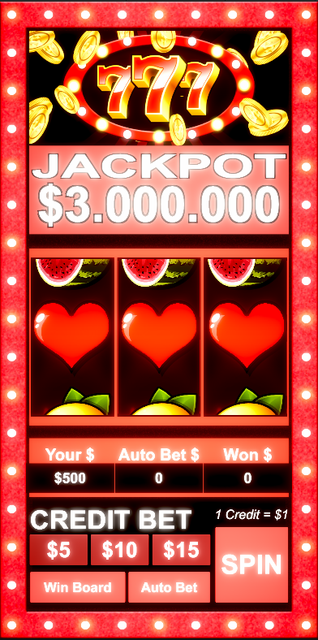
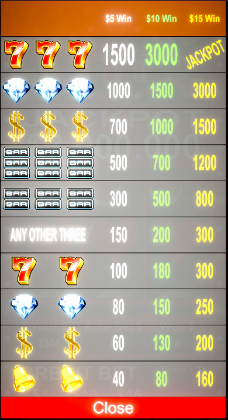
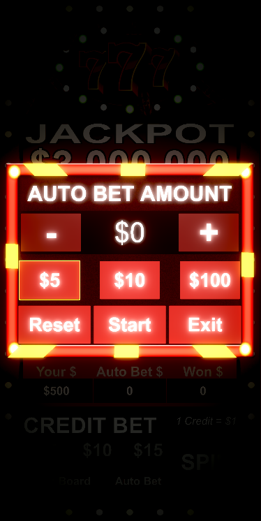
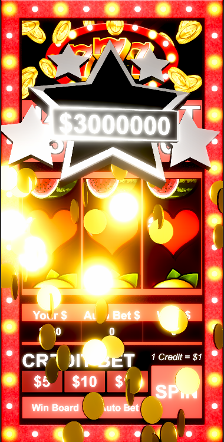
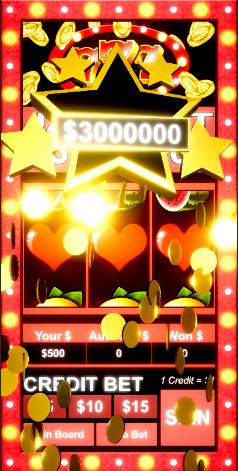

# Unity3DClasssicSlotMachineGame
A small Slot Machine Game which is created by Unity 3D and C# language

[Watch Demo on Youtube](https://www.youtube.com/watch?v=UYpJN-trPM0)

***************************** <b>Game Features</b> *****************************

## 1. Normal Bet
> * Manual Spin/Stop
> * Select bet amount for each spin
## 2. Auto Bet
> * Auto Spin/Stop
> * Select total bet amount for auto bet
> * Select bet amount for each spin
## 3. Display Win Board List
## 4. Implement Win Effect for double match and triple match
## 5. Implement Calculation for using money and win money
## 6. Implement some animations.

***************************** <b>Game UI</b> *****************************

  
<b>>> Main Game <<</b>

  

  
  
<b>>> Win Board List <<</b>

  

  
<b>>> Auto Bet Panel <<</b>

  

  
  
<b>>> Double Win <<</b>

  

    
  
<b>>> Triple Win <<</b>

  

